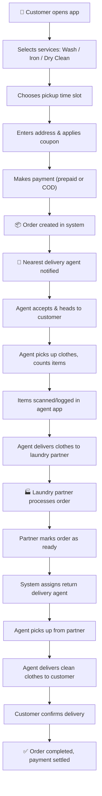
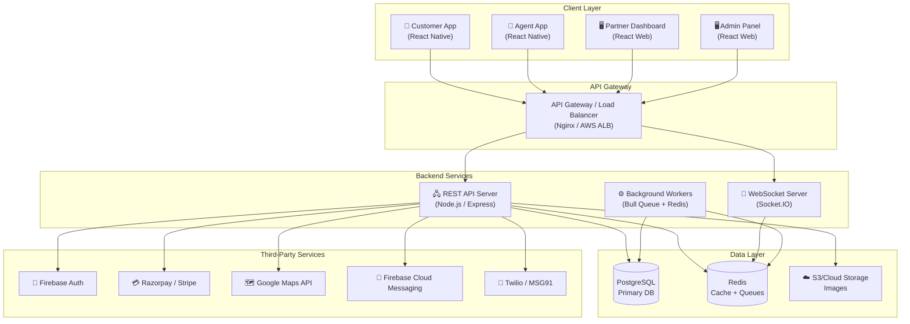

# 🧺 Complete Technical & Business Breakdown: Zepto-Style Laundry Service App

> A comprehensive guide for a beginner developer/freelancer to understand, build, and price an on-demand laundry & ironing platform.

---

## 1. PRODUCT BREAKDOWN

### How It Works in Real Life

Think of **Zepto for groceries**, but instead of delivering tomatoes in 10 minutes, you're **picking up dirty clothes and delivering them back clean**. The business model is a **three-sided marketplace**:

| Side | Role |
|------|------|
| **Customer** | Places laundry orders via the app |
| **Delivery Agent** | Picks up and delivers clothes |
| **Laundry Partner** | Washes, irons, or dry-cleans the clothes |

The **platform** (your app) sits in the middle, orchestrating everything and taking a commission.

### Full Order Lifecycle (Real-World Flow)



**Key Insight:** Unlike food delivery (one-way trip), laundry requires **two delivery legs** (pickup → partner → customer). This doubles the logistics complexity.

### Real-World Timeline Example

| Step | Time |
|------|------|
| Customer places order | T+0 |
| Agent assigned | T+2 min |
| Pickup from customer | T+30–60 min (time slot) |
| Delivered to laundry partner | T+1–2 hrs |
| Laundry processing | T+12–48 hrs |
| Return delivery | T+24–72 hrs |
| **Total turnaround** | **24–72 hours** |

---

## 2. USER ROLES & SYSTEMS

You're not building **one app** — you're building **four systems**.

### 2.1 📱 Customer App (Mobile — iOS & Android)

**Purpose:** The consumer-facing app where users place and track orders.

| Responsibility | Details |
|----------------|---------|
| Onboarding | Sign up/login via phone OTP or social login |
| Service browsing | View wash, iron, dry-clean with pricing per item |
| Address management | Save multiple addresses with GPS auto-detect |
| Scheduling | Pick a date + time slot for pickup |
| Payments | Pay via UPI, card, wallet, or COD |
| Order tracking | Real-time status updates + live delivery tracking |
| Order history | Past orders with repeat-order functionality |
| Notifications | Push notifications for every status change |
| Support | In-app chat or call for order issues |
| Coupons & referrals | Apply promo codes, invite friends for credits |

### 2.2 🛵 Delivery Agent App (Mobile)

**Purpose:** Used by pickup/delivery personnel to manage assigned tasks.

| Responsibility | Details |
|----------------|---------|
| Order queue | View assigned pickups and deliveries |
| Navigation | In-app maps to customer & partner locations |
| Item verification | Count and log items at pickup |
| Status updates | Mark: arrived → picked up → delivered |
| Earnings dashboard | View daily/weekly earnings and incentives |
| Availability toggle | Go online/offline |
| Photo proof | Take photo of handover as proof of delivery |

### 2.3 🏭 Laundry Partner Dashboard (Web or Tablet)

**Purpose:** Used by laundry shops to manage incoming work.

| Responsibility | Details |
|----------------|---------|
| Incoming orders | Accept/view orders assigned to them |
| Item-level tracking | Mark individual items: received → processing → done |
| Quality check | Flag damaged or stained items |
| Ready notification | Mark batch as ready for return pickup |
| Pricing settings | Set service prices and turnaround times |
| Earnings/payout | View completed orders and pending payments |

### 2.4 🖥️ Admin Panel (Web Dashboard)

**Purpose:** Central command for the platform owner.

| Responsibility | Details |
|----------------|---------|
| User management | View/suspend customers, agents, partners |
| Order management | Monitor all orders across the platform |
| Analytics | Revenue, order volume, agent utilization |
| Pricing control | Set base prices, commissions, surge rules |
| Coupon management | Create and manage promo codes |
| Payout management | Process payments to agents and partners |
| Zone management | Define serviceable areas/pincodes |
| Dispute resolution | Handle refund requests and complaints |

---

## 3. CORE FEATURES (MVP)

> **MVP Goal:** Get the first 100 orders working end-to-end. No fancy features — just the core flow.

### Customer App MVP

| # | Feature | Why It's Essential |
|---|---------|-------------------|
| 1 | Phone OTP login | Simple, secure auth (Firebase Auth) |
| 2 | Service catalog | List of wash/iron/dry-clean with per-item pricing |
| 3 | Address input | Manual + Google Places autocomplete |
| 4 | Time-slot picker | Fixed slots like 9–11 AM, 2–4 PM |
| 5 | Order placement | Cart → review → confirm |
| 6 | Payment (basic) | Razorpay/Stripe integration (UPI + cards) |
| 7 | Order status | Simple status bar: Placed → Picked Up → Processing → Out for Delivery → Delivered |
| 8 | Push notifications | FCM for order status updates |
| 9 | Order history | List of past orders |
| 10 | Basic profile | Name, phone, saved addresses |

### Delivery Agent App MVP

| # | Feature |
|---|---------|
| 1 | Login + verification |
| 2 | View assigned orders |
| 3 | Navigate to pickup/drop location |
| 4 | Update order status |
| 5 | Item count confirmation |
| 6 | Basic earnings view |

### Admin Panel MVP

| # | Feature |
|---|---------|
| 1 | View all orders |
| 2 | Manually assign agents |
| 3 | Manage users and partners |
| 4 | Basic revenue reports |
| 5 | Service/pricing configuration |

### Laundry Partner MVP

| # | Feature |
|---|---------|
| 1 | View assigned orders |
| 2 | Update order processing status |
| 3 | Mark as ready for pickup |

---

## 4. ADVANCED FEATURES

These are what separate a basic app from a **scalable platform**:

### 4.1 Real-Time Order Tracking
- **How:** WebSocket connection (Socket.IO) between agent app and customer app
- **Agent's phone** sends GPS coordinates every 5–10 seconds
- **Customer sees** a live map (Google Maps / Mapbox) with the agent's location
- **Complexity:** Medium-High — requires persistent connections, battery optimization, background location services

### 4.2 Route Optimization
- **Problem:** An agent has 5 pickups in the same area — what's the optimal route?
- **Solution:** Google Maps Directions API or OSRM (open-source)
- **Why:** Reduces delivery time by 20–30%, cuts fuel costs
- **Real Example:** Like Uber Pool — batching multiple rides in one route

### 4.3 Surge Pricing
- **When:** High demand (festival season, rainy days) + low agent supply
- **How:** Multiplier on base price (1.2x, 1.5x, 2x) based on supply-demand ratio
- **Implementation:** Background job checks order volume vs available agents per zone every few minutes

### 4.4 Delivery Batching
- **Concept:** Instead of one agent per order, batch 3–4 nearby orders for one agent
- **Benefit:** Reduces cost per delivery by 40–60%
- **Complexity:** Requires geospatial clustering algorithms (k-means on lat/lng)

### 4.5 Subscription Plans
- **Example:** "₹999/month — 4 pickups, 20 items, free delivery"
- **Implementation:** Subscription table in DB, check on order placement, auto-renew via payment gateway

### 4.6 AI Demand Prediction
- **Purpose:** Predict order volume by zone and time to pre-position agents
- **Data needed:** Historical orders, weather, holidays, events
- **Tech:** Simple ML model (Linear Regression or XGBoost) trained on order data
- **When to build:** Only after 10,000+ orders — you need data first

---

## 5. SYSTEM ARCHITECTURE

### High-Level Architecture Diagram



### Recommended Tech Stack for Beginners

| Layer | Technology | Why This Choice |
|-------|-----------|-----------------|
| **Mobile App** | React Native (Expo) | One codebase → iOS + Android. Huge community. |
| **Web Dashboards** | React.js + Vite | Fast dev, reusable components |
| **Backend API** | Node.js + Express.js | JavaScript everywhere, easy to learn |
| **Database** | PostgreSQL | Robust, handles relational data well |
| **Cache/Queue** | Redis | Fast in-memory store for sessions, queues |
| **Real-time** | Socket.IO | Easy WebSocket abstraction |
| **Auth** | Firebase Authentication | Phone OTP, Google login — zero backend code for auth |
| **Payments** | Razorpay (India) / Stripe (Global) | Best docs, easy SDK |
| **Maps** | Google Maps SDK + Places API | Industry standard |
| **Push Notifications** | Firebase Cloud Messaging (FCM) | Free, cross-platform |
| **File Storage** | AWS S3 or Firebase Storage | Store item photos, receipts |
| **Hosting** | AWS EC2 or Railway / Render | EC2 for production, Railway for MVP |
| **CI/CD** | GitHub Actions | Free for public repos, easy setup |

### Database Schema (Core Tables)

```
users (id, name, phone, email, role, created_at)
addresses (id, user_id, label, lat, lng, full_address, is_default)
services (id, name, description, icon_url)  -- e.g., Wash, Iron, Dry Clean
service_items (id, service_id, name, price)  -- e.g., Shirt ₹30, Jeans ₹50
orders (id, customer_id, address_id, status, total, payment_status, 
        pickup_slot, created_at)
order_items (id, order_id, service_item_id, quantity, price)
agents (id, user_id, is_online, current_lat, current_lng, zone_id)
deliveries (id, order_id, agent_id, type[pickup/drop], status, 
            started_at, completed_at)
partners (id, name, address, lat, lng, zone_id, is_active)
payments (id, order_id, amount, method, gateway_txn_id, status)
notifications (id, user_id, title, body, is_read, created_at)
coupons (id, code, discount_type, discount_value, min_order, 
         expires_at, usage_limit)
zones (id, name, polygon_coordinates, is_active)
```

### API Structure (RESTful)

| Endpoint Group | Example Endpoints |
|----------------|-------------------|
| **Auth** | `POST /auth/send-otp`, `POST /auth/verify-otp` |
| **Services** | `GET /services`, `GET /services/:id/items` |
| **Orders** | `POST /orders`, `GET /orders/:id`, `PATCH /orders/:id/status` |
| **Addresses** | `GET /addresses`, `POST /addresses` |
| **Payments** | `POST /payments/initiate`, `POST /payments/webhook` |
| **Agent** | `PATCH /agent/location`, `GET /agent/orders`, `PATCH /agent/availability` |
| **Partner** | `GET /partner/orders`, `PATCH /partner/orders/:id` |
| **Admin** | `GET /admin/orders`, `GET /admin/analytics`, `POST /admin/coupons` |

---

## 6. DEVELOPMENT COMPLEXITIES

### 6.1 Real-Time Delivery Tracking 🔴 HIGH

**The Challenge:**
- Agent must send location in the **background** even when app is minimized
- iOS aggressively kills background processes
- Must be battery-efficient (can't poll GPS every second)

**Solution:**
- Use `react-native-background-geolocation` (handles iOS/Android background modes)
- Send updates every 10 seconds via WebSocket
- On the customer side, interpolate between points for smooth map animation
- Fallback to polling every 30 seconds if WebSocket disconnects

### 6.2 Scaling the Backend 🟡 MEDIUM

**The Problem:** What if you go from 10 orders/day to 10,000 orders/day?

**Solutions (Progressive):**
1. **Start:** Single server on Railway/Render — handles 0–500 orders/day
2. **Next:** Move to AWS EC2 + RDS (managed PostgreSQL)
3. **Scale:** Add Redis caching, database connection pooling (PgBouncer)
4. **Growth:** Horizontal scaling with load balancer, read replicas for DB
5. **Enterprise:** Microservices (split order service, payment service, notification service)

> **Beginner Tip:** Don't over-engineer Day 1. Start monolithic, refactor later.

### 6.3 Order Assignment Algorithm 🔴 HIGH

**Naive Approach (MVP):** Notify all nearby agents → first-come-first-served

**Smart Approach (Production):**
```
1. Filter agents within 3km radius of pickup address
2. Filter agents who are online and not on a delivery
3. Rank by:
   - Distance to pickup (40% weight)
   - Agent rating (30% weight)
   - Current idle time (20% weight)
   - Acceptance rate (10% weight)
4. Notify top-ranked agent first
5. If no response in 30 seconds → notify next agent
6. If no agent accepts in 5 minutes → expand radius to 5km
```

### 6.4 Inventory/Item Management 🟡 MEDIUM

**The Problem:** Customer says they gave 5 shirts; laundry partner received 4. Who's responsible?

**Solution:**
- **At pickup:** Agent counts and logs each item type in the app
- **At partner:** Partner verifies count upon receiving
- **Discrepancy alert:** System flags mismatches automatically
- **Photo evidence:** Require a photo of the items at each handover point

### 6.5 Fraud Prevention 🟡 MEDIUM

| Fraud Type | Prevention |
|------------|------------|
| Fake orders | OTP verification, phone number validation |
| Repeated cancellations | Flag accounts with >3 cancels, require prepaid |
| Agent theft | Item-count verification at each step, photos |
| Fake delivery | GPS verification — agent must be within 100m of address |
| Payment fraud | Use payment gateway's built-in fraud detection |
| Coupon abuse | Limit per-user, device fingerprinting |

---

## 7. DEVELOPMENT ROADMAP

### Phase 1 — MVP (Launch & Validate) 🟢

**Goal:** Prove the concept works. Get the first 50–100 paying customers.

| Component | What to Build |
|-----------|---------------|
| Customer App | Login, service catalog, order placement, basic status tracking, payment |
| Agent App | Login, view orders, update status, basic navigation |
| Partner | Simple web page or even WhatsApp-based communication |
| Admin | Basic React dashboard — view orders, manage users |
| Backend | Monolithic Node.js API, PostgreSQL, Firebase Auth |
| Infra | Single server (Railway/Render), minimal cloud setup |

**What to SKIP in Phase 1:**
- ❌ Live map tracking
- ❌ Automatic agent assignment (do it manually or first-come)
- ❌ Subscription plans
- ❌ Multi-city support
- ❌ Ratings system

---

### Phase 2 — Production Ready 🟡

**Goal:** Handle 100–1000 orders/day reliably.

| Component | Additions |
|-----------|-----------|
| Customer App | Live tracking, ratings, order re-order, referral system |
| Agent App | Route optimization, earnings dashboard, batch deliveries |
| Partner Dashboard | Full web dashboard with item tracking, quality management |
| Admin | Analytics, coupon management, zone management, payout processing |
| Backend | Redis caching, background job queue, WebSocket server, smart agent assignment |
| Infra | AWS (EC2 + RDS + ElastiCache + S3), CI/CD pipeline |

---

### Phase 3 — Scalable Platform 🔴

**Goal:** Multi-city expansion, 10,000+ orders/day.

| Component | Additions |
|-----------|-----------|
| Features | Subscription plans, surge pricing, AI demand prediction, loyalty program |
| Backend | Microservices architecture, event-driven (Kafka/RabbitMQ) |
| Data | Data warehouse (BigQuery/Redshift), analytics pipeline |
| Ops | Kubernetes, auto-scaling, multi-region deployment |
| ML | Demand prediction, dynamic pricing, fraud detection ML models |
| Business | Multi-city zones, franchise partner onboarding, B2B/corporate accounts |

---

## 8. TIME ESTIMATION

### Phase 1 — MVP

| Team Type | Duration | Notes |
|-----------|----------|-------|
| **Solo beginner** | 5–7 months | Learning + building. Expect re-writes. |
| **Small team** (2 devs + 1 designer) | 2.5–3.5 months | One frontend, one backend dev |
| **Experienced team** (4–5 devs) | 6–8 weeks | Parallel workstreams |

### Phase 2 — Production Ready

| Team Type | Duration |
|-----------|----------|
| **Solo beginner** | +4–6 months additional |
| **Small team** | +2–3 months additional |
| **Experienced team** | +4–6 weeks additional |

### Phase 3 — Scalable Platform

| Team Type | Duration |
|-----------|----------|
| **Any team** | Ongoing (3–6+ months additional) |

> **Total (MVP through Production):** A solo beginner should realistically budget **9–13 months** of full-time work. A small team can do it in **5–7 months**.

---

## 9. COST ESTIMATION

### MVP Version

| Item | USD | INR |
|------|-----|-----|
| Customer App (React Native) | $3,000–$5,000 | ₹2.5L–₹4L |
| Delivery Agent App | $1,500–$3,000 | ₹1.2L–₹2.5L |
| Admin Panel (Web) | $1,500–$2,500 | ₹1.2L–₹2L |
| Backend API + Database | $2,000–$4,000 | ₹1.6L–₹3.2L |
| Partner Dashboard (Basic) | $500–$1,000 | ₹40K–₹80K |
| UI/UX Design | $1,000–$2,000 | ₹80K–₹1.6L |
| 3rd-party integrations | $500–$1,000 | ₹40K–₹80K |
| **Total MVP** | **$10,000–$18,500** | **₹8L–₹15L** |

### Full Production Version

| Item | USD | INR |
|------|-----|-----|
| Everything in MVP (polished) | $15,000–$25,000 | ₹12L–₹20L |
| Real-time tracking | $3,000–$5,000 | ₹2.5L–₹4L |
| Advanced admin + analytics | $3,000–$5,000 | ₹2.5L–₹4L |
| Subscription system | $1,500–$2,500 | ₹1.2L–₹2L |
| Testing + QA | $2,000–$3,000 | ₹1.6L–₹2.5L |
| DevOps + deployment | $1,500–$2,500 | ₹1.2L–₹2L |
| **Total Production** | **$25,000–$45,000** | **₹20L–₹36L** |

### Monthly Running Costs (Post-Launch)

| Service | Monthly Cost |
|---------|-------------|
| AWS / Cloud hosting | $50–$300 |
| Google Maps API | $50–$200 (based on usage) |
| Payment gateway | 2% per transaction |
| SMS / OTP | $20–$50 |
| Push notifications (FCM) | Free |
| Domain + SSL | $10–$20 |
| **Total/month (MVP scale)** | **$150–$600** |

---

## 10. COMMON MISTAKES BEGINNER FREELANCERS MAKE

### ❌ Mistake 1: Building Everything at Once
> "The client asked for AI prediction and surge pricing, so I'll build it all."

**Fix:** Build MVP first. Prove it works. Layer advanced features in Phase 2+. Tell the client: *"We validate with MVP, then scale."*

### ❌ Mistake 2: No Written Contract
> "We discussed everything on a call, they'll remember."

**Fix:** Always have a signed contract/SOW with:
- Exact feature list
- Number of revisions included
- Payment milestones
- Timeline
- What's NOT included (maintenance, app store submission, etc.)

### ❌ Mistake 3: Underpricing the Project
> "I'll charge ₹50K for the whole app to get the project."

**Fix:** Calculate: `(hours needed × your hourly rate) × 1.5 buffer`. A full laundry app is **NOT** a ₹50K project. Even MVP is ₹8L+. Under-pricing leads to burnout and unfinished projects.

### ❌ Mistake 4: Not Accounting for Backend Complexity
> "I'll focus on the app UI and add the backend later."

**Fix:** Backend is 60% of the work. Start with API design and database schema first. Build UI around it.

### ❌ Mistake 5: Ignoring Edge Cases
> "What if two agents accept the same order?" "What if the payment fails after order is placed?"

**Fix:** Map every user flow end-to-end, including failure cases. Use proper database transactions and idempotency keys.

### ❌ Mistake 6: No Maintenance Agreement
> "I delivered the app, I'm done."

**Fix:** Apps need ongoing maintenance — bug fixes, OS updates, API changes. Charge a monthly retainer (₹15K–₹50K/month) for maintenance.

### ❌ Mistake 7: Skipping Testing
> "It works on my phone, ship it."

**Fix:** Test on at least 5 different devices. Test slow networks. Test edge cases (no GPS, payment timeout, expired session).

---

## 11. FREELANCER STRATEGY

### Contract Structure

```
PROJECT: LaundryGo - On-Demand Laundry Platform
CLIENT: [Client Name]
DEVELOPER: [Your Name]
DATE: [Start Date]

SCOPE:
- Customer mobile app (iOS + Android)
- Delivery agent mobile app
- Admin web dashboard
- Backend API + database
- Payment gateway integration
- Push notifications

OUT OF SCOPE:
- App Store / Play Store submission (can be added for extra fee)
- Marketing website
- Post-launch feature additions
- Server maintenance beyond 1 month
- Content creation (service descriptions, images)

REVISIONS: Up to 3 rounds of UI revision included
```

### MVP Definition Document (Give This to Your Client)

Draft a **1-page MVP scope document** that clearly lists:

| Included in MVP ✅ | NOT in MVP ❌ |
|--------------------|--------------|
| Phone OTP login | Social login (Google/Apple) |
| Service catalog | AI recommendations |
| Order placement | Subscription plans |
| Basic status tracking | Live map tracking |
| Razorpay payment | Multi-currency support |
| Push notifications | In-app chat |
| Admin order view | Advanced analytics |

### Milestone Payment Structure

| Milestone | Deliverable | Payment |
|-----------|------------|---------|
| **Signing** | Contract signed, project begins | 20% |
| **Design Approval** | UI/UX designs approved | 15% |
| **Backend Complete** | APIs + database, tested on Postman | 20% |
| **App Alpha** | Working apps with core features | 20% |
| **Beta + Testing** | Bug-fixed, tested on real devices | 15% |
| **Launch** | Deployed to stores | 10% |

> **Golden Rule:** Never do more than 20% of the work without receiving the corresponding payment.

### Maintenance Agreement (Post-Launch)

| Tier | Coverage | Monthly Rate |
|------|----------|-------------|
| **Basic** | Bug fixes + server monitoring | $150–$250 / ₹12K–₹20K |
| **Standard** | Basic + minor feature updates + OS compatibility | $300–$500 / ₹25K–₹40K |
| **Premium** | Standard + priority support + performance optimization | $500–$800 / ₹40K–₹65K |

### How to Present This to Your Client

> *"I recommend we build this in phases. Phase 1 is the MVP — it gets your platform live with real users in 3 months. We can validate the idea, get feedback, and then invest in Phase 2 features like live tracking and subscriptions. This is how every successful startup — Zepto, Uber, Urban Company — built their platforms. They didn't launch with everything on Day 1."*

---

## Quick Reference: Your Action Plan

```
Week 1     → Sign contract, receive 20% advance
Week 2–3   → Database schema design + API architecture
Week 3–4   → UI/UX design (Figma) + client approval
Week 5–8   → Backend development (APIs, auth, payments)
Week 7–10  → Customer app development
Week 9–11  → Agent app development
Week 10–12 → Admin panel
Week 12–13 → Integration testing + bug fixes
Week 13–14 → Deployment + client handover
```

> [!TIP]
> **Start with the backend and database design, not the UI.** This is the most common mistake beginners make. A beautiful app with a broken backend is useless. A working backend with a basic UI is a working product.

> [!IMPORTANT]
> **Always get 20% upfront before writing a single line of code.** This protects you from non-serious clients and covers your time investment in project setup.
